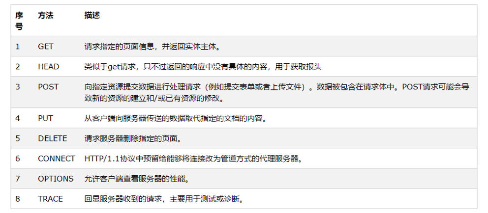

【简答6*5'=30'】
## 计算机网络定义
P19 计算机网络主要是由一些通用的，可编程的硬件互联而成的，可用来传送多种不同类型的数据，支持广泛的应用。
## 网络作用范围分类
P20
1. 作用范围分类:广域网WAN，城域网MAN，局域网LAN，个人局域网PAN
2. 使用者分类：公用网，专用网
3. 用来把用户接入互联网的网络:接入网
## OSI/RM体系结构描述、五层体系、TCP/IP协议栈体系
1. OSI:物理层，数据链路层，网络层，运输层，会话层，表示层，应用层
2. TCP/IP:网络接口层，网络层，运输层，应用层
3. 五层协议:物理层，数据链路层，网络层，运输层，应用层
## 时延有哪些
P22
1. 发送时延
2. 传播时延
3. 处理时延
4. 排队时延

## 基带编码有哪些
P42 
1. 不归零制 正代表1，负代表0
2. 归零制度 正脉冲代表1，负脉冲代表0
3. 曼彻斯特编码，跳变向上为1，跳变向下为0
4. 差分曼彻斯特编码，开始处有跳变则是0，无跳变为1

## TCP/IP属于网络层的协议有
IP,ICMP网际报文,RIP路由选择协议,OSPF开放最短路径优先,BGP外部网关协议,IGMP网际组管理协议

## CSMA/CD算法步骤
1. 准备发送，获得分组，加上以太网首部尾部，组成以太网帧
2. 检测信道:如信道忙，则继续检测，如在96bit时间内信道空闲，发送帧
3. 发送过程中检测:一边发送一边监听，如果检测到碰撞停止发送，发送人为干扰信号，根据指数退避算法，等待一定时间回到步骤2继续检测，16次不成功放弃传输并向上报错
4. 发送完一帧暂时保留，如果争用期内发生碰撞，一段时间后重传该帧

## 常用传输媒体和特点
1. 双绞线:误码率高，价格便宜，且安装方便
2. 同轴电缆：低误码率、性能价格比高，易受低频干扰
3. 光缆:通信容量大：抗干扰性能好，误码率低。但光电接口的价格较昂贵
4. 微波:干扰较小、传播质量高、通信比较稳定。传播时延较大，技术较复杂，价格较贵

## IPv6地址长度，过渡方法
过度方法:
1. 双协议栈，一部分主机或路由器装有双协议栈，既能与IPV6系统通信，也能与IPV4系统通信
2. 隧道技术，把IPV6封装成IPV4数据报，离开隧道时再把数据报部分交给IPV6协议栈

IPv6地址有128位，采用冒号16进制记法(7个冒号，8x4位16进制数):
- FF05::B3 中间0省略
- :: 全0地址

## 信道复用技术解释，常见的信道复用技术
- 在发送端使用一个复用器，把所有发送端的信号合起来使用一个共享信道进行通信，在接收端采用分用器，把合起来的信息分别送到相应终点
- 常用频分复用FDM,时分复用TDM,码分复用CDM,波分复用WDM

## RIP坏消息传得慢的原因
当路由器R1到网1的链路出现故障，R1无法到达网1，路由器R1将距离改成16，但是可能R2先把更新信息发给R1，导致路由器R1误认为可经过R2到达网1，并把更新后的信息发送给R2，这样的更新一直继续，知道R1和R2与网1距离都达到16时，R1和R2才知道网1不可达，这一过程消耗了较长时间。

## 集线器、网桥、二层交换机工作原理和异同

## 虚拟局域网作用(VPN是虚拟专用网)
限制了广播域，使得广播域限制于一个VLAN内，增加了局域网安全性。
## 什么是mime？
P292

MIME是通用互联网邮件扩充(Multipurpose Internet Mail Extensions)，定义了传送非ASCII码的编码规则

## SMTP通信三阶段，是什么，过程
1. 连接建立,SMTP客户每隔一定时间对邮件缓存扫描一遍,若发现有邮件,就使用SMTP的熟知端口号25与接收方邮件服务器的SMTP服务器建立TCP连接
2. 邮件传送,邮件的传送从MAIL命令开始,把邮件传送给收件人
3. 连接释放,邮件发送完毕后,SMTP客户发送QUIT命令,SMTP返回221信息,释放TCP连接。

## 域名服务器高速缓存的作用（考两次功能）
近期访问过的域名信息存在缓存中，再次访问时直接从缓存读取，不需要重新解析，加快了域名相应的速度，减轻了域名服务器的负担

## 域名解析作用
把域名映射为IP地址

## 对于一个具体的域名写出迭代解析过程
？

## 网络拓扑分类和特点
？

【分析5*6'=30】
## 具体的CIDR是否包含计算
?
## IP报头构成和作用，TCP协议报头构成和作用
IP报头:版本(4位，IPv4为4)，首部长度(4位，x4)，区分服务(8b)，总长度(16b)，标识(16b)，标志(3b,第一位无意义，MF=1有更多分片,DF=0可分片)，片偏移(13b)，生存时间(8b，限制数据报跳数)，协议(8b，ICMP等)，首部检验和(16b)，源地址(32b)，目的地址(32b)，填充(凑整)

TCP报头:源端口号(16b)，目的端口号(16b)，序号(32b，字节流的序号)，32b确认号(32b，期望收到的下一个序号)，首部长度(4b)，保留位(6b)，标志位(6b，ACK,SYN,FIN)，窗口大小(16b，预留空间)，检验和(16b)，紧急指针(16b，紧急数据的字节数)

## ARP是什么，协议作用，使用ARP四种典型情况有哪些（考了两次）
ARP是地址解析协议，已知一个主机的ip地址，找出其MAC地址。

可以画图法解释:P127
1. 发送方是主机，要把IP数据报发送到同一个网络的另一台主机,此时H1广播发送ARP请求分组，找到另一台主机MAC地址
2. 发送方是主机，要把IP数据报发送到另一个网络的另一台主机,此时H1发送ARP请求分组，找到该网络上的一个路由器R1的MAC地址，剩下的工作交给路由器完成
3. 发送方是路由器，要把IP数据报发送到连接在同一个网络上的主机,此时R1发送ARP请求分组，找到该网络上主机的MAC地址
4. 发送方是路由器，要把IP数据报发送到不连接在同一个网络上的主机,此时R1发送ARP请求分组，找到另一个连接在同一个网络上的路由器的硬件地址，剩下的工作交给另一个路由器完成。

## 域名解析过程，高速缓存功能（考了两次功能）
主机向本地域名服务器递归查询，如果不知道所查询域名，以DNS客户身份向其他根域名服务器继续发出查询请求报文。本地域名服务器向根域名服务器迭代查询，要么给出ip地址，要么告诉本地域名服务器下一步应该给向哪一个域名服务器查询(根域名服务器，顶级域名服务器，权限域名服务器)

近期访问过的域名信息存在缓存中，再次访问时直接从缓存读取，不需要重新解析，使互联网上DNS查询请求和回答报文数量大为减少，减轻了域名服务器的负担

## 域名系统递归和迭代两种查找算法各自特点
主机向本地域名服务器递归查询，如果不知道所查询域名，以DNS客户身份向其他根域名服务器继续发出查询请求报文。本地域名服务器向根域名服务器迭代查询，要么给出ip地址，要么告诉本地域名服务器下一步应该给向哪一个域名服务器查询(根域名服务器，顶级域名服务器，权限域名服务器)

## HTTP中GET和POST分别用来什么操作'

## 分组交换是什么？
P15

采用存储转发技术，把一个报文划分为几个分组后在进行传送，无建立时延，不需要预先建立一条专用通信线路，线路利用率高，存在传输时延，数据包可能出现失序、丢失、重复分组，
要对分组按编号进行排序等工作。

## 课本题，传送报文交换和电路交换计算
？
## FTP与TFTP主要区别
1. TFTP协议不需要验证客户端的权限，FTP需要进行客户端验证，
2. FTP客户与服务器间的通信使用TCP，而TFTP客户与服务器间的通信使用的是UDP
3. TFTP只支持文件传输而不支持交互

## HTTP1.0无状态含义，好处
P268

同一个客户第二次访问同一个服务器上的页面，服务器响应和第一次相同。简化了服务器设计，使得服务器更容易支持大量并发HTTP请求

## 端口作用，端口号三类种类
两个计算机的进程互相通信不仅要知道对方的ip地址而且还要知道端口号，可以找到对方计算机中的应用进程。

1. 服务器端使用的端口号，TCP/IP最重要的一些应用程序使用，0-1023
2. 客户端使用的端口号，49152-65535，客户运行时动态选择
3. 登记端口号，1024-49151，为没有熟知端口号的应用使用

## OSPF是什么，特点
开放最短路径优先OSPF,路由选择协议，使用链路状态协议
1. 使用洪泛法向所有路由器发送信息
2. 发送的信息是与本路由器相邻的所有路由器的链路状态
3. 链路状态发送变化时才洪范发送信息，不像RIP定期发送信息

## RIP和OSPF优缺点
RIP:不需要每次网络拓扑更改时都进行更新,适用于小型网络
OSPF:没有跳数限制,状态更新并仅在网络发生变化时发送更新

## 分析POP工作过程，POP和IMAP区别
POP3采用C/S工作方式，用户需要输入鉴别信息读取邮箱内容，读取邮件后，POP3服务器删除该邮件。

区别:IMAP是一个联机协议，需要与服务器建立TCP连接，用户未发送删除邮件命令前，服务器一直保留邮件。而POP3读取邮件后服务器便删除

## DHCP是什么，工作过程
动态主机配置协议DHCP，使用客户服务器模式，需要IP地址的主机在启动时向DHCP服务器广播发送DCHP DISCOVER报文(目的IP地址全1，源ip全0)，DHCP服务器如果找到该主机配置信息，则返回找到的信息，若找不到，则从ip地址池分配一个地址，以DHCP OFFER报文返回

## 活动文档和动态文档有什么区别
1. 静态文档是指内容固定的文档，它是由万维网服务器创建，并存放在其中。. 
2. 动态文档是指文档的内容是在浏览器访问服务器时才得以创建。. 
3. 活动文档是指能够提供了一种连续更新屏幕内容的技术,这种技术把创建文档的工作移到浏览器端进行。

计算题4*5'=20'
## 不归零，曼彻斯特画图
曼彻斯特看跳变方向，不归零1为高电平，0为低电平？
## IEEE802.3局域网传递ASCII信息封装MAC，计算帧有效字节，需要填充多少字节
？
## UDP数据报字段已知长度分为几个IP数据报片，每一个数据报片字段长度和偏移字段值（考过两次）
满足片大小整除8？

## 页面和超链接读取页面，检索网点所需最少时间
？
## 码片序列ABC三个站具体码片计算
胡科大有

## 数据CRC校验怎么算（肯定考）
看具体问题，除法计算

## 带宽和时延求最大吞吐量和信道利用率
公式？

## 网络前缀长最大主机数、等分子网、子网掩码、主机数（去掉特殊地址）、地址块、最大最小地址（肯定考，综合或计算）
地址分配问题，胡椒笔记有
## TCP已知初始RTO 旧RTTS 新RTT 求新RTO
公式书上面有

设计题
## 一个公司6个部门，每个部门20个人，一个网段如何划分子网？
20+2<32=2^5

综合题2*10'=20'
## 数据报分片，数据字段长度，片偏移字段，MF标志（考过两次）
easy
## 拥塞窗口ssthresh慢开始拥塞避免超时每一次变化cwnd大小和原因，超时和3次ack（肯定考，综合或计算）
拥塞控制相关
## 滑动窗口，将要发送，最大帧序号
滑动窗口相关
## 路由表计算下一跳（4-20）
路由表
## RIP路由更新
修改路由表
## 两个TCP报文段给序号，携带多少数据，收到确认号为多少，balbalb（）课本题目四小问题修改数字

1-17 3-07 4-20 4-22 **4-37** **4-41** **4-54** **5-31** 5-38 5-59